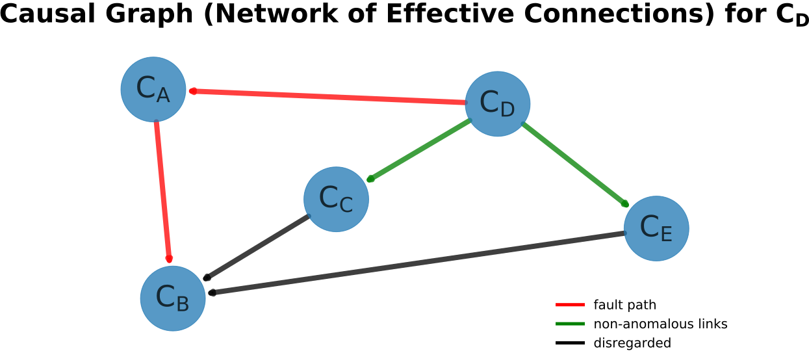
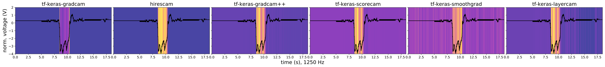

# Neuro-Symbolic Diagnosis State Machine


[](https://opensource.org/licenses/MIT)

Neuro-symbolic diagnosis state machine (generalizing [**vehicle_diag_smach**](https://github.com/tbohne/vehicle_diag_smach)).

## State Machine Architecture


> Iterative, hybrid neuro-symbolic approach for anomaly detection and complex fault diagnosis, enabling knowledge-based (symbolic) methods to complement (neural) machine learning methods and vice versa. Explainability is indispensable for diagnosis and arises naturally in the system through the specific interplay of neural and symbolic methods. The reasoning of the system is encoded in a state machine architecture.

## Neuro-Symbolic Architecture

Essentially, the *Diag. Circuit* is implemented through this repository, the *Neural Network Architectures* through [**oscillogram_classification**](https://github.com/tbohne/oscillogram_classification), and the *Knowledge Graph* through [**nesy_diag_ontology**](https://github.com/tbohne/nesy_diag_ontology).


## Dependencies

- for Python requirements, cf. `requirements.txt`
- [**Apache Jena Fuseki**](https://jena.apache.org/documentation/fuseki2/): SPARQL server hosting / maintaining the knowledge graph

## Installation (from source)

Install diagnosis state machine and dependencies:
```
$ git clone https://github.com/tbohne/nesy_diag_smach.git
$ cd nesy_diag_smach/
$ pip install .
```
Set up *Apache Jena Fuseki* server:
```
$ cd ..
$ curl -L https://dlcdn.apache.org/jena/binaries/apache-jena-fuseki-VERSION.tar.gz > apache-jena-fuseki-VERSION.tar.gz
$ tar -xvzf apache-jena-fuseki-VERSION.tar.gz
$ chmod +x apache-jena-fuseki-VERSION/fuseki-server
```
For configuration, i.e., hosting the knowledge graph, cf. [nesy_diag_ontology](https://github.com/tbohne/nesy_diag_ontology) (section "*Launch knowledge graph from RDF serialization (e.g., `.nq.gz` / `.nt` / `.owl` / `.ttl` file*")).

## Source Usage

Run server (knowledge graph) from *Apache Jena Fuseki* root directory (runs at `localhost:3030`):
```
$ ./apache-jena-fuseki-VERSION/fuseki-server
```
Run state machine (in `nesy_diag_smach/`):
```
$ python nesy_diag_smach/nesy_diag_state_machine.py
```

## Multivariate `torch` Demo

- TBD (!)
- cf. `config.py`
- host corresponding demo KG, i.e., `nesy_diag_smach/res/backup_2025_03_20-11_10_16.nt.gz`
- install + run

## Univariate `keras` Demo

- cf. `config.py`
- host corresponding demo KG, i.e., `nesy_diag_smach/res/backup_2025_03_20-11_10_16.nt.gz`
- install + run

## Univariate Fault Isolation Result Example


## Multivariate Fault Isolation
- TBD (!)

## Univariate Heatmap Example


## Multivariate Heatmap Example

### Time Attribution Maps
- TBD (!)

### Variable Attribution Maps
- TBD (!)

## Related Publications

```bibtex
@inproceedings{10.1145/3587259.3627546,
    author = {Bohne, Tim and Windler, Anne-Kathrin Patricia and Atzmueller, Martin},
    title = {A Neuro-Symbolic Approach for Anomaly Detection and Complex Fault Diagnosis Exemplified in the Automotive Domain},
    year = {2023},
    isbn = {9798400701412},
    publisher = {Association for Computing Machinery},
    address = {New York, NY, USA},
    url = {https://doi.org/10.1145/3587259.3627546},
    doi = {10.1145/3587259.3627546},
    booktitle = {Proceedings of the 12th Knowledge Capture Conference 2023},
    pages = {35–43},
    numpages = {9},
    location = {Pensacola, FL, USA},
    series = {K-CAP '23}
}
```
